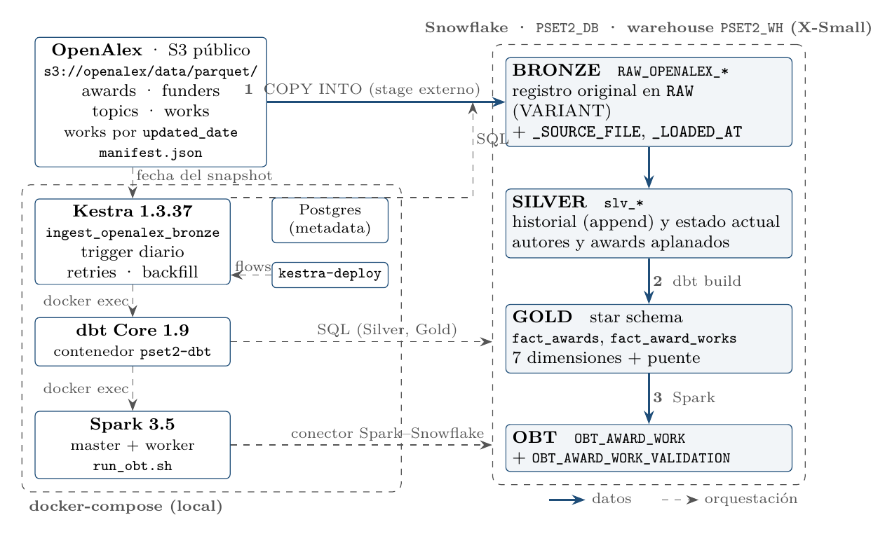

# PSet 2 — Subvenciones con Ruta: Pipeline ELT End-to-End

```
Fuente (S3: OpenAlex / NSF)
   → Kestra (ingesta + orquestación, COPY INTO)
   → Snowflake BRONZE (dato crudo)
   → dbt SILVER (limpieza)
   → dbt GOLD (star schema)
   → Spark (One Big Table)
   → Snowflake OBT
```



Diagramas de arquitectura y del star schema (imagen + fuente TikZ): [docs/diagramas/](docs/diagramas/).

## Estructura
```
pset_2/
├── docker-compose.yml      # Kestra + Postgres + dbt + Spark (red pset2_net)
├── .env.example            # plantilla de variables (copiar a .env)
├── kestra/flows/           # flows YAML (se sincronizan solos)       -> ROL 1
├── dbt/                    # proyecto dbt (bronze/silver/gold)        -> ROL 2
├── spark/jobs/             # jobs PySpark                             -> ROL 3
└── docs/                   # prompt maestro, roles, SQL de Snowflake, memo, diagramas
```

## 1. Requisitos
- Docker Desktop (Compose v2.24+) con **≥ 8 GB de RAM** asignados (Kestra ~1.6 GB, Spark worker 3 GB, master/driver ~1 GB).
- Git. Cuenta de Snowflake (trial sirve) con permisos para crear DB/warehouse.
- En Windows: ejecutar los comandos desde PowerShell, Git Bash o WSL.

## 2. Primer arranque (paso a paso)
```bash
# 1) Clonar y entrar
git clone <URL_DEL_REPO>
cd <repo>/pset_2

# 2) Crear tu .env (NUNCA se sube a GitHub)
cp .env.example .env          # PowerShell: Copy-Item .env.example .env
#    -> edita .env con tus credenciales de Snowflake y define KESTRA_USER/PASSWORD

# 3) Preparar Snowflake (una sola vez por equipo)
#    Pega docs/snowflake_setup.sql en un worksheet de Snowflake y ejecútalo con ACCOUNTADMIN.

# 4) Levantar la infraestructura
docker compose up -d
docker compose ps             # todos "running"/"healthy"
```

| Servicio | URL / acceso |
|---|---|
| Kestra UI | http://localhost:8080, solo desde tu máquina (usuario/clave = `KESTRA_USER` / `KESTRA_PASSWORD`; `KESTRA_USER` debe ser un email; `KESTRA_PASSWORD` es obligatoria) |
| Spark Master UI | http://localhost:8090 |
| Spark Worker UI | http://localhost:8091 |
| dbt | contenedor `pset2-dbt` (se usa con `docker compose exec dbt ...`) |

> Si `.env` queda vacío, el compose usa valores por defecto locales (`PSET2_DB`, `BRONZE`, ...), pero **Snowflake no conectará** sin `SNOWFLAKE_ACCOUNT`, `SNOWFLAKE_USER` y `SNOWFLAKE_PASSWORD`.

## 3. Ejecutar cada componente

### Kestra (ingesta y orquestación)
1. Abre http://localhost:8080 e inicia sesión. Al hacer `docker compose up`, el servicio `kestra-deploy` importa los `.yml` de `kestra/flows/` en el namespace `pset2`. Si editas un flow, vuelve a desplegarlo con `docker compose up kestra-deploy`.
2. Ejecuta `smoke_test_snowflake` para comprobar la conexión.
3. **`ingest_openalex_bronze`** es el pipeline completo: carga a `BRONZE` con `COPY INTO` topics, funders y awards (completos) y las particiones nuevas de works (watermark contra el último snapshot de OpenAlex), y luego corre `dbt build` y la OBT de Spark.
   - **Automático:** trigger `daily` (06:00 UTC). Déjalo activo en **una sola** instancia de Kestra del equipo.
   - **Manual:** botón **Execute**.
   - **Backfill de históricos:** Execute con `backfill_from` / `backfill_to`.
4. Las credenciales de los flows salen del `.env` (`{{ envs.snowflake_user }}`, …); nunca se escriben en el repositorio.

Diseño, retries, idempotencia y consultas de verificación: [docs/ingesta_kestra.md](docs/ingesta_kestra.md).

### dbt (Silver y Gold)
```bash
docker compose exec dbt dbt debug                   # verifica conexión a Snowflake
docker compose exec dbt dbt run                     # construye modelos
docker compose exec dbt dbt test                    # pruebas not_null / unique / relationships
docker compose exec dbt dbt build --select silver+  # run + test de Silver y dependientes
docker compose exec dbt dbt docs generate
```
El código vive en `dbt/` (montado como volumen: se edita desde tu PC, sin reconstruir imagen).

### Spark (One Big Table)
```bash
docker compose exec spark-master /opt/spark-apps/run_obt.sh
```
Lee el star schema de `GOLD`, construye `OBT.OBT_AWARD_WORK`, valida el grain y la escribe en Snowflake. La primera ejecución descarga el conector (~1 min). Detalle, pruebas locales y autenticación con llave RSA en [spark/README.md](spark/README.md).

### Pipeline completo
Kestra carga Bronze → `dbt build` (Silver, Gold) → job Spark (OBT en el esquema `OBT`). Orden y nombres de tablas: [docs/ROLES.md](docs/ROLES.md#contrato-de-interfaces).

## 4. Comandos útiles
```bash
docker compose logs -f kestra        # logs de un servicio
docker compose restart kestra        # reiniciar un servicio
docker compose down                  # apagar (conserva datos de Kestra)
docker compose down -v               # apagar y BORRAR volúmenes (reset total)
```

## 5. Trabajo en equipo (para no pisarse)
- Cada rol edita **solo su carpeta** (ver [docs/ROLES.md](docs/ROLES.md)). Ramas sugeridas: `feat/kestra`, `feat/dbt`, `feat/spark`; PR a `main` con aprobación del Tech Lead.
- Cambios en `docker-compose.yml`: solo en tu sección marcada `[ROL X]`; avisen al Tech Lead.
- Cada quien usa su propio `.env` local. Si agregan una variable nueva, **añádanla también a `.env.example`** (vacía).
- Antes de cada commit: `git status` y confirmar que no aparece `.env` ni datos (`.gitignore` los bloquea).
- Prompts para trabajar con IA: [docs/PROMPT_MAESTRO.md](docs/PROMPT_MAESTRO.md).

## 6. Solución de problemas
| Síntoma | Causa / solución |
|---|---|
| Kestra no abre en :8080 | Esperar ~30–60 s tras `up`; ver `docker compose logs kestra`. Si Postgres no está *healthy*, `docker compose down -v` y reintentar. |
| `Bind for 0.0.0.0:8080 failed` | Puerto ocupado: cambia el mapeo `8080:8080` en el compose. |
| Flow no aparece en Kestra | `docker compose logs kestra-deploy`: muestra qué flow falló al importarse (YAML inválido, `id` o `namespace` faltante). Re-despliega con `docker compose up kestra-deploy`. |
| dbt: `Env var required but not provided` | Falta una variable en `.env`; luego `docker compose up -d dbt` para recrear el contenedor. |
| Cambié `.env` y no se refleja | `docker compose up -d` (recrea contenedores con las nuevas variables). |
| Kestra responde 401 o Snowflake rechaza el login con un `.env` que "está bien" | El `.env` tiene fines de línea de Windows (CRLF) o espacios alrededor del `=`. Guárdalo con LF y sin espacios: `KEY=valor`. Luego `docker compose up -d`. |
| Snowflake: `404 Not Found ... login-request` | `SNOWFLAKE_ACCOUNT` es solo el *locator* (`AB12345`). Agrega región y nube (`AB12345.us-east-2.aws`) o usa el formato `ORGNAME-ACCOUNTNAME`. |
| El job de Spark queda en `Initial job has not accepted any resources` | El worker perdió el registro con el master (pasa si la Mac se suspende con el stack arriba). `docker compose restart spark-worker`: el job retoma solo. |
| Spark se queda sin memoria | Baja `SPARK_WORKER_MEMORY` o sube la RAM de Docker Desktop. |
| `docker.sock` falla en Windows | Usar Docker Desktop con backend WSL2. |

## 7. Seguridad
`.env`, llaves (`*.pem`, `*.p8`, `*.key`), datos (`*.parquet`, `*.csv`, `*.gz`) y artefactos locales están en `.gitignore`. **Nunca** pegues credenciales en flows, modelos, notebooks ni en el README.
