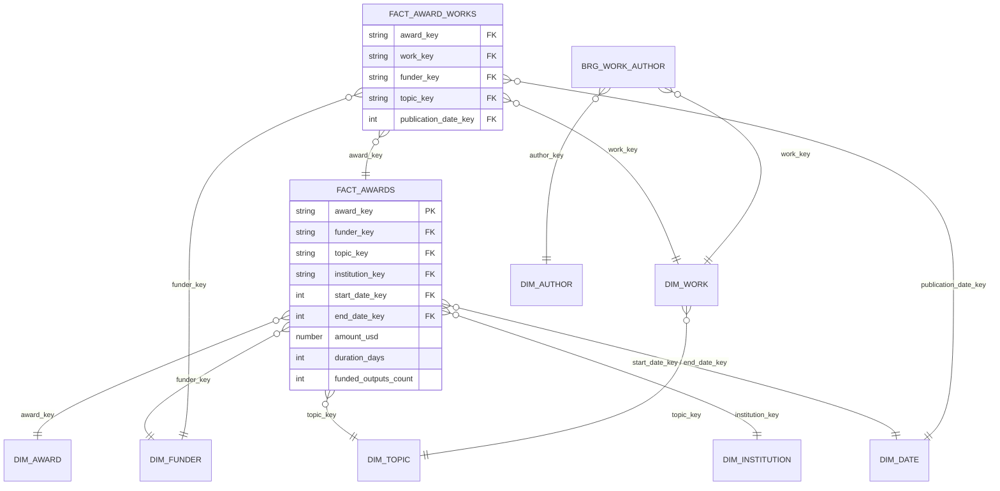

# Secciones 3 y 4 del memo (rol dbt)

> **Antes de entregar:** los valores `‹A04›`, `‹W07›`, etc. salen de `dbt/analyses/data_quality_profile.sql`, corrido sobre los datos que cargó Kestra. Reemplaza cada marcador por el porcentaje y el conteo de la fila con ese ID (por ejemplo, "18,4 % (3.127.402 de 17.003.118)"). No dejes cifras inventadas.

---

## 3. Calidad de datos

Perfilamos Bronze antes de transformar, con una consulta que mide cada problema con su conteo y porcentaje (`analyses/data_quality_profile.sql`). Revisamos las cuatro dimensiones que pide el PSet: completitud, precisión (exactitud del valor), consistencia y validez. Agregamos unicidad, porque OpenAlex reemite registros cuando cambian. Ninguna corrección borra un award o un work válido por un campo malo: se anula el campo, se marca con una bandera y la decisión queda documentada en el `.sql` del modelo.

| # | Problema | Evidencia | Acción | Justificación |
|---|---|---|---|---|
| A03 / A02 | Un mismo award aparece en varias versiones (`updated_date` distinta) y, si Kestra recarga un archivo, en copias exactas | ‹A03› con más de una versión; ‹A02› copias exactas | Historial con grain award + versión (`slv_awards_history`, append). La tabla de estado actual (`slv_awards`) se queda con la versión más reciente. Las copias exactas se descartan. | OpenAlex mueve un registro a la partición de su nueva fecha cuando cambia. Sin esto, cada carga incremental duplicaría awards y los montos se sumarían dos veces. |
| A04 | Awards sin `description` | ‹A04› | Se conservan, con `has_description = false` | La ayuda existe y cuenta para los análisis de financiamiento, pero sin texto no se puede vectorizar. La OBT filtra con la bandera en vez de perder la fila en Silver. |
| A05 | Awards sin monto | ‹A05› | Se deja `NULL`; no se imputa | Que falte el monto depende del financiador (algunos no lo publican), así que no es un faltante al azar (probable MNAR). Imputar con la media inventaría dinero y sesgaría por financiador. |
| A06 | Montos ≤ 0 | ‹A06› de los awards con monto | `amount = NULL` y `is_amount_invalid = true` | Una ayuda de 0 o negativa no es un monto real; en la práctica es "no informado". |
| A07 | Montos en monedas distintas de USD | ‹A07› de los awards con monto | `amount_usd` solo cuando `currency = 'USD'` | Sumar EUR con USD da cifras sin sentido. No convertimos monedas (queda en Limitaciones). |
| A08 | Fecha de fin anterior a la de inicio | ‹A08› de los awards con ambas fechas | `end_date = NULL` y `has_inconsistent_dates = true` | Viola una regla del dominio; la duración calculada sería negativa. |
| A09 | Sin fecha de inicio exacta | ‹A09› sin fecha ni año | Si hay `start_year`, se usa el 1 de enero y se marca `is_start_date_from_year` | Conserva la dimensión de tiempo sin fingir precisión de día. |
| A10 | Descripciones con etiquetas HTML | ‹A10› de las descripciones | Se quitan las etiquetas y los espacios repetidos | ` ` y `
` (típicos en NSF) ensucian los embeddings. |
| A11 / A12 | Award sin funder, o con un funder que no está en el catálogo | ‹A11› / ‹A12› | En Gold van al miembro `UNKNOWN` de `dim_funder` | Mantiene la integridad referencial sin descartar el award. |
| A01 / W01 | Registros sin ID | ‹A01› / ‹W01› | Se descartan | Sin llave no se pueden unir, deduplicar ni testear. |
| W04 | Works sin abstract | ‹W04› | Se conservan con `has_abstract = false` | El work sigue siendo una publicación financiada; para el perfil del investigador queda el título. |
| W05 | Año de publicación imposible | ‹W05› | `publication_year = NULL` | Son errores de captura (años 0 o 9999). |
| W07 | Autorías sin `author_id` | ‹W07› de las autorías | Se descartan en `slv_work_authorships` | Sin ID no hay forma de construir el perfil del investigador ni de enlazarlo con sus awards. |
| W08 | El mismo autor repetido en un work | ‹W08› | Se deja una vez, con su primera posición | Evita contar doble una autoría en el puente work-autor. |
| W09 | Works que citan un award no cargado | ‹W09› de los enlaces | El enlace queda en Silver; Gold solo admite awards existentes | Consecuencia de cargar un subconjunto. Medirlo dice cuánta cobertura se pierde. |

**Consistencia de llaves.** OpenAlex entrega los IDs como URL (`https://openalex.org/G5066037109`) y otras tablas los referencian igual. Normalizamos todo al ID corto (`G5066037109`) con una macro (`oa_id`), así cada entidad tiene la misma llave en todas las tablas.

**Tests que validan reglas del negocio** (además de `not_null`, `unique` y `relationships` en todas las llaves):

- monto > 0;
- `amount_usd` solo para awards en USD;
- fecha de fin ≥ fecha de inicio;
- año de publicación posible;
- `author_position` ∈ {first, middle, last};
- código de moneda ISO de 3 letras;
- `fact_awards` con exactamente una fila por award de Silver, para comprobar que ningún JOIN duplicó ni perdió filas.

---

## 4. Transformaciones y modelado

**Bronze** (lo carga Kestra). Cada tabla guarda el registro original completo en una columna `VARIANT`, más el archivo de origen y la hora de carga. Así se conserva el dato tal cual, se aguantan los campos nuevos que agrega OpenAlex y las listas anidadas quedan intactas para aplanarlas después.

**Silver** (dbt, esquema `SILVER`). Tipa, limpia y normaliza:

- **Historiales** `slv_awards_history` y `slv_works_history`. Grain: registro + versión. Incremental con **append**: una versión es un evento inmutable y solo se insertan las que llegaron en la última carga (filtro sobre `_loaded_at`). Es la regla del equipo para eventos estáticos.
- **Estado actual** `slv_awards` y `slv_works`. Una fila por registro, incremental con **merge**. Es una excepción deliberada: representan el estado vigente, y con append un award actualizado aparecería dos veces. El merge solo toca los registros de la última carga, así que tampoco escanea la tabla completa. Además, nunca reemplaza una versión nueva por una vieja (por ejemplo, si un backfill trae particiones antiguas).
- **Listas aplanadas** `slv_work_authorships` y `slv_work_awards`. Incremental con **delete+insert** por work: cuando un work cambia, se reemplazan sus autorías y enlaces. En `slv_works` se reconstruye el abstract a partir del índice invertido de OpenAlex.
- **Catálogos** `slv_funders` y `slv_topics`. Se materializan como `table`: son pequeños (miles de filas) y cambian en cada snapshot.

**Gold** (dbt, esquema `GOLD`). Esquema estrella para el recomendador de financiamiento:

- **`fact_awards`**. **Grain: una fila por award otorgado.** Llaves hacia `dim_award`, `dim_funder`, `dim_topic`, `dim_institution` y `dim_date` (inicio y fin). Métricas: `amount_usd` (aditiva), `duration_days`, `funded_outputs_count`, `institutions_count` y `award_count`.
- **`fact_award_works`**. **Grain: una fila por publicación financiada por un award.** Es un hecho sin métricas y la verdad de terreno del modelo: si un trabajo de un investigador fue financiado por un award, ese perfil fue pertinente para ese financiamiento. No lleva el monto, porque en este grain se repetiría por publicación y sumarlo inflaría el dinero.
- **Dimensiones:**
  - `dim_award` guarda el texto que se vectoriza;
  - `dim_topic` desnormaliza la jerarquía dominio > campo > subcampo > tema;
  - `dim_funder`, `dim_institution`, `dim_work`, `dim_author` y `dim_date`;
  - el puente `brg_work_author` resuelve la relación muchos a muchos entre publicaciones y autores.
- **Integridad:** todas las llaves foráneas son NOT NULL y tienen test `relationships`. Lo que no se puede resolver apunta a un miembro `UNKNOWN` (o `-1` en fechas) en vez de quedar nulo o perder la fila.

**Dependencias.** Silver lee Bronze solo con `source()`. Todo lo demás usa `ref()`, así dbt arma el DAG y ejecuta en orden: catálogos e historiales, después estado actual, dimensiones y hechos.

**Limitaciones de esta capa** (para la sección 7):

- No se convierten monedas, así que el análisis de dinero usa solo USD.
- Si un work se carga antes que el award que lo financió, ese enlace no entra a Gold hasta un `dbt build --full-refresh` de `fact_award_works`.
- Los casos negativos del recomendador (awards que una persona no obtuvo) no son observables: no sabemos si postuló y fue rechazada o si nunca postuló.
