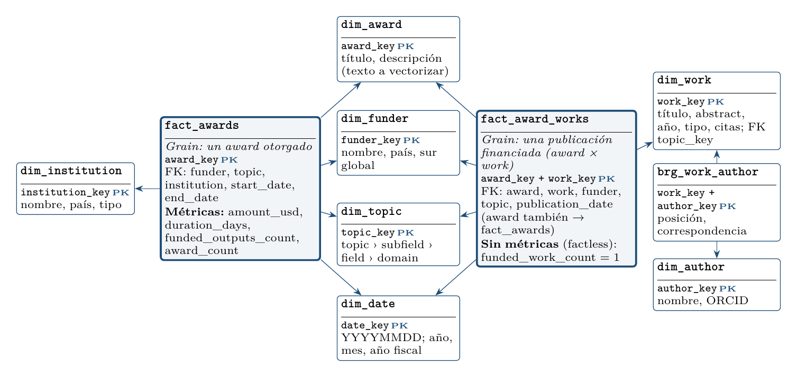

# Diagramas del PSet 2

| Diagrama | Imagen | Fuente (TikZ) |
|---|---|---|
| Arquitectura implementada (infraestructura y flujo de datos) | [`arquitectura.png`](arquitectura.png) | [`arquitectura.tex`](arquitectura.tex) |
| Modelo dimensional de la capa GOLD (star schema) | [`star_schema.png`](star_schema.png) | [`star_schema.tex`](star_schema.tex) |




## Editar y regenerar

Los `.tex` son fragmentos `tikzpicture` que se incluyen con `\input{...}`. Necesitan:
- las librerías `positioning`, `arrows.meta`, `fit` y `backgrounds`;
- tres colores: `acento` `#1F4E79`, `gris` `#555555` y `filaclara` `#F2F5F8`.

Plantilla mínima:

```latex
\documentclass{article}
\usepackage{xcolor,tikz}
\usetikzlibrary{positioning,arrows.meta,fit,backgrounds,shapes.geometric}
\definecolor{acento}{HTML}{1F4E79}\definecolor{gris}{HTML}{555555}\definecolor{filaclara}{HTML}{F2F5F8}
\pagestyle{empty}
\begin{document}\noindent\input{arquitectura.tex}\end{document}
```

Son los mismos diagramas del memo técnico (Figuras 1 y 2).
